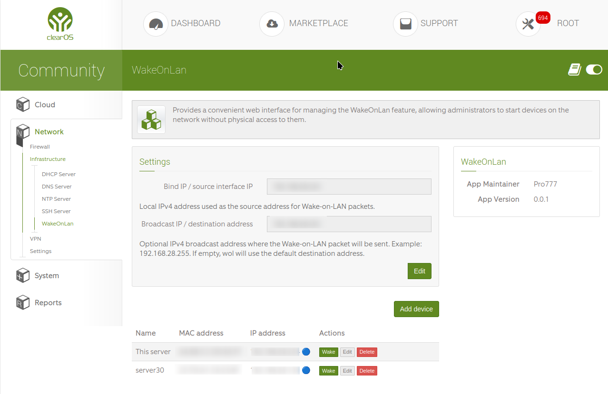

# WakeOnLan for ClearOS

ClearOS web interface for managing Wake-on-LAN devices and sending Wake-on-LAN packets from the ClearOS administrator panel.

The app is useful when you need to start computers, servers, POS terminals, or other network devices remotely without physical access to them.

## Screenshot



## Features

- Add, edit, and delete Wake-on-LAN devices.
- Store device name, MAC address, and optional IP address.
- Send a Wake-on-LAN magic packet from the web interface.
- Display device availability status by IP address.
- Select the local IPv4 address used as the source interface for Wake-on-LAN packets.
- Configure an optional broadcast / destination IPv4 address.
- Input validation for MAC and IPv4 addresses.
- Basic request rate limiting for save and wake actions.
- Ukrainian and English localization.

## Requirements

- ClearOS 7 / ClearOS webconfig environment.
- `wol` command-line utility installed on the ClearOS server.
- Devices with Wake-on-LAN enabled in BIOS/UEFI and operating system network settings.
- Network equipment that allows Wake-on-LAN packets to reach the target device.

## Installation from source

Clone this repository into the ClearOS apps directory using the app basename `wakeonlan`:

```bash
cd /usr/clearos/apps
git clone https://github.com/snuglinux/app-wakeonlan.git wakeonlan
chown -R root:root /usr/clearos/apps/wakeonlan
find /usr/clearos/apps/wakeonlan -type d -exec chmod 0755 {} \;
find /usr/clearos/apps/wakeonlan -type f -exec chmod 0644 {} \;
```

Make sure the `wol` utility is available:

```bash
which wol
```

If it is missing, install the package that provides `wol` for your ClearOS system.

## Usage

Open the ClearOS web interface and go to:

```text
Network → Infrastructure → WakeOnLan
```

### Settings

- **Bind IP / source interface IP** — local IPv4 address used as the source interface for sending Wake-on-LAN packets.
- **Broadcast IP / destination address** — optional destination/broadcast IPv4 address. Example: `192.168.28.255`.

If the broadcast address is empty, the app uses the default destination behavior of the `wol` utility.

### Devices

Each device entry contains:

| Field | Description |
| --- | --- |
| Name | Friendly device name shown in the table. |
| MAC address | Target device MAC address. |
| IP address | Optional IP address used to display online/offline status. |

Use **Wake** to send a Wake-on-LAN packet to the selected device.

## Troubleshooting

### Check that Wake-on-LAN works from terminal

```bash
wol -p 9 AA:BB:CC:DD:EE:FF
```

With a specific broadcast address:

```bash
wol -i 192.168.28.255 -p 9 AA:BB:CC:DD:EE:FF
```

### Common checks

- Wake-on-LAN is enabled in the target device BIOS/UEFI.
- Wake-on-LAN is enabled in the target operating system driver settings.
- The target device is connected by Ethernet.
- The MAC address is correct.
- The broadcast address matches the target subnet.
- Firewall/router rules do not block UDP Wake-on-LAN traffic, commonly port `9`.

## Repository structure

```text
controllers/   ClearOS controller for the WakeOnLan page and AJAX actions
libraries/     WakeOnLan library: device list, settings, local IPv4 detection
views/         Web interface view
htdocs/       Web assets, if present in the app package
language/      Localization files
deploy/        ClearOS app metadata
```

## Screenshot file

Place the screenshot in the repository here:

```text
images/wakeonlan.png
```

Then add it together with the README:

```bash
mkdir -p images
# copy your screenshot to: images/wakeonlan.png

git add README.md images/wakeonlan.png
git commit -m "Add README screenshot"
```

## License

GPLv3
